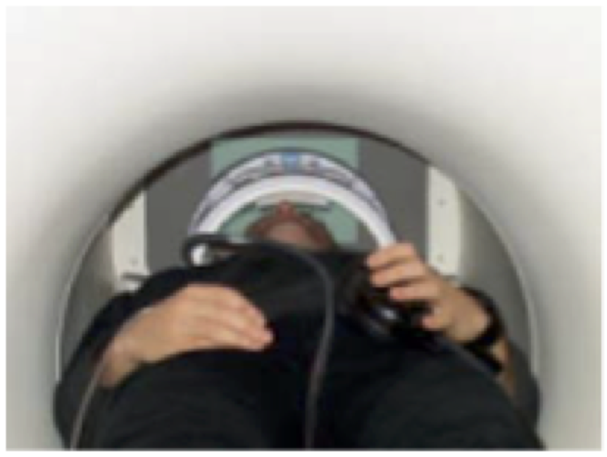

# Template MRI Brochure

## 1. How to use this template brochure?

This is a template brochure to be used by investigators of the Donders Institute. This template is based on brochures that previously have been approved by an accredited medical-ethical Reviewing Committee (the “Commissie Mensgebonden Onderzoek Regio Arnhem-Nijmegen”), it is not an approved brochure. Investigators and their centers should use this template to make a brochure that is to be approved by some ethical reviewing committee. The actual information brochure starts from _2. General_.

This is a template for a MRI information brochure. It is not guaranteed that this template will fit all purposes. It is the responsibility of the investigators and their centers to make it fit. For example, it may be that some content of this template does apply to the investigator’s research, or that some essential information is missing. Also, it may be that the wording used in this template is not appropriate for a particular participant group (e.g., children or patients).

## 2. General

MRI stands for ‘Magnetic Resonance Imaging’. This method allows us to take images of the inside of the human body. By using a strong magnetic field and radio waves radio signals are generated in the body. These signals are picked up by an antenna and with the help of a computer pictures of cross-sections of the human body can be produced. At the Donders Institute mainly a variation of this technique called fMRI (f = functional) is used. With fMRI it is possible to see both the structure and the activity of the brain. An fMRI experiment usually lasts one to two hours.

## 3. Preparation

Metal objects are attracted to the magnet and/or disturb the measurement. Also there is a slight chance metal can warm-up. Therefore please take into account the following:

- The clothing on your upper body may not contain any metal (e.g. zips, buttons, hooks, braces). This also applies to bras containing a metal brace wire. 
- Jewellery, piercings, hairpins, glasses, etc with metal parts must be removed. Please do not use mascara as this sometimes contains metal fragments. 
- Coins, keys, cigarette lighters, cell phones, penknives, cufflinks etc must be removed and can be stored in a locker. The same goes for bank cards, credit cards and chip cards. Otherwise the strong magnetic field will erase the information stored on the magnetic strip.

## 4. The experiment

After the researcher has informed you about the experiment you will enter the shielded magnet room and lie down on the movable table. Please relax and lie as comfortable as possible. During the experiment the scanner will make a lot of knocking sounds and noises of varying volumes. Ear protection is a must. Hence you will be given headphones or earplugs to reduce the noise. A frame (= the antenna) is placed over your head. It is important to lie as still as possible during the scanning. Hence your head is fixated with small cushions. Before the researcher moves you inside the scanner you will be given a rubber ball to hold in your hand. If you squeeze the ball during the experiment this will sound an alarm which tells the researcher to stop the experiment. During the scan the door to the MRI room is shut, but not locked. An experiment consists of several scans. The shortest lasts for 10 seconds and the longest about forty minutes. In total a scan session lasts one to two hours. Via the intercom the researcher keep you informed about the progress of the experiment. not be locked. The researcher can see you via a video camera and you can communicate via an intercom. Sometimes the experiment will be video and/or -audio recorded for strict scientific purposes. The experimenter will inform you about this in timely fashion prior to the experiment.

## 5. Clinically relevant information

We want to emphasize that the researchers at the Donders Institute do not examine the data acquired from a medical perspective. Participation in any of the experiments cannot be considered as a medical nor screening test. In exceptional circumstances the new data collected may give indications concerning your health conditions. Prior to participation you are required to provide name and address of your home physician. In case of a suspected abnormality which is of clinical relevance you will be informed by your home physician. In case you do not have a home physician (in the Netherlands) you are requested to register as a patient at the Academic General Practitioner Center Heyendaal. In the exceptional circumstance of a clinically relevant finding you will be either informed by your own home physician or the general practitioner of the Academic Center. Your insurance policy will cover these costs; In case you are uninsured the Academic GP Center is required to charge you a minimal amount for consultation. You cannot participate in MRI research at the Donders Institute if you do not want be informed about an incidental finding.

## 6. Additional information

The risk associated with participation can be considered as negligible. No invasive procedures are involved. 
You can NOT participate in a MRI-experiment if one of the following applies:

1. Metal parts, that cannot be removed, are present in or on your upper body, e.g. plates, screws, aneurysm clips, metal splinters, piercings or medical plasters. Dental fillings, crowns, a metal wire behind the teeth, tattoos and contraceptive coils are allowed. The researcher will additionally inform you. 
2. Clothing on the upper body containing any metal e.g. zips, buttons, hooks, braces, metal yarn (LUREX). This also applies to bras containing a metal brace wire. 
3. You have an active implant, a pacemaker, insulin pump, neurostimulator and/or ossicle prosthesis. 
4. You have a history of brain surgery. 
5. You suffer from epilepsy. 
6. You suffer from claustrophobia. 
7. You are pregnant or you think you are. 
8. You are younger than 18 years of age.
