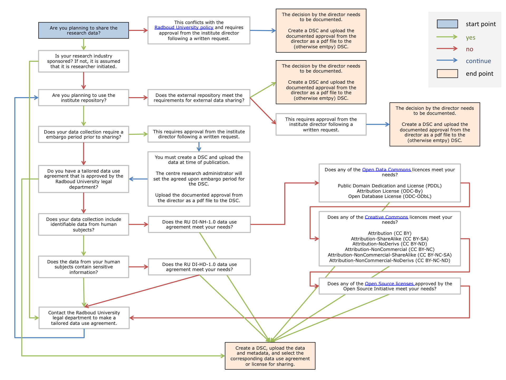

# Data Sharing

## 1. Data use agreements

To share data, analysis pipelines and/or software in a "data sharing collection", the collection manager needs to select a Data Use Agreement (DUA) and close the collection. Only closed collections can be accessed by external users.

The following data use agreements can apply to collections that include potentially identifiable data from human subjects:

  * [RU-DI-HD-1.0-draft](../agreements/RU-DI-HD-1.0-draft.md)  

The following data use agreement can apply to collections that only include data that cannot be identified in any way (e.g. only group results):

  * [RU-DI-NH-1.0-draft](../agreements/RU-DI-NH-1.0-draft.md)

Furthermore, the following data use agreements can be used in the case that the Donders Institute specific DUA does not meet the requirements.

  * [CC-BY-4.0](../agreements/CC-BY-4.0.md)
  * [CC-BY-NC-4.0](../agreements/CC-BY-NC-4.0.md)
  * [CC-BY-NC-ND-4.0](../agreements/CC-BY-NC-ND-4.0.md)
  * [CC-BY-NC-SA-4.0](../agreements/CC-BY-NC-SA-4.0.md)
  * [CC-BY-ND-4.0](../agreements/CC-BY-ND-4.0.md)
  * [CC-BY-SA-4.0](../agreements/CC-BY-SA-4.0.md)
  * [ODC-BY-1.0](../agreements/ODC-BY-1.0.md)
  * [ODC-ODbL-1.0](../agreements/ODC-ODbL-1.0.md)
  * [ODC-PDDL-1.0](../agreements/ODC-PDDL-1.0.md)

The following agreements can apply to collections that only include source code of software, simulations or data analysis scripts:

  * [APACHE-2.0](../agreements/APACHE-2.0.md)
  * [ARTISTIC-2.0](../agreements/ARTISTIC-2.0.md)
  * [BSD](../agreements/BSD.md)
  * [EPL-1.0](../agreements/EPL-1.0.md)
  * [GPL-2.0](../agreements/GPL-2.0.md)
  * [GPL-3.0](../agreements/GPL-3.0.md)
  * [LGPL-3.0](../agreements/LGPL-3.0.md)
  * [MIT](../agreements/MIT.md)
  * [MPL-2.0](../agreements/MPL-2.0.md)
  * [ISC](../agreements/ISC.md)

## 2. Decision tree for deciding on a DUA

Please follow the data sharing flowchart to guide your decisions with regards to data sharing.

  

## 3. Non-standard data use agreements

The rationale for providing a list of data use agreements to choose from is that there are different types of data and not all can be dealt with under a single license. The RU-DI-HD and RU-DI-NH template data use agreements will be able to cover many of the data sharing collections.

If the are specific requirements for data sharing (e.g. due to requirements of the grant, or due to requirements of external collaborating partners in the project that generates the data), it is required to make a custom DUA. Aspects to be considered in the design of a new data use agreement are

1.	If applicable, the agreement must specify how to deal with subject confidentiality issues.
2.	If applicable, the agreement must specify how to deal with ethical issues regarding animal research.
3.	The agreement must  specify the requirement to abide to all laws and regulations (both in the jurisdiction of the data recipient and in the Netherlands)
4.	The agreement should specify whether there are restrictions to the use of the data.
5.	The agreement should specify whether and how original and derived data can be redistributed and/or shared.
6.  The agreement should specify the liability for data and derived data that is redistributed.
7.	The agreement should specify whether and how credits and acknowledgements are to be handled.
8.	The agreement may specify specific situations under which the agreement is terminated.

The new data use agreement must be reviewed by the legal department of the Radboud University.

## 4. External links

  * http://www.ru.nl/publish/pages/721701/universitair_beleid_opslag_en_management_onderzoeksdata_cvb_besluit_25-11-2013.pdf
  * http://creativecommons.org
  * http://opendefinition.org
  * http://opendatacommons.org
  * http://opensource.org/licenses
  * http://choosealicense.com
