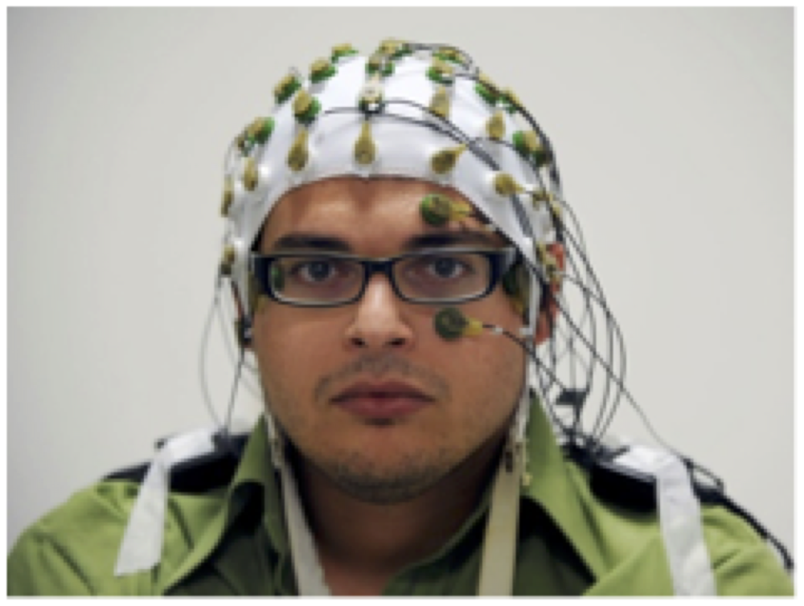

# Template EEG Brochure

## 1. How to use this template brochure?

This is a template brochure to be used by investigators of the Donders Institute. This template is based on brochures that previously have been approved by an accredited medical-ethical Reviewing Committee (the “Commissie Mensgebonden Onderzoek Regio Arnhem-Nijmegen”), it is not an approved brochure. Investigators and their centers should use this template to make a brochure that is to be approved by some ethical reviewing committee. The actual information brochure starts from _2. General_.

This is a template for a EEG information brochure. It is not guaranteed that this template will fit all purposes. It is the responsibility of the investigators and their centers to make it fit. For example, it may be that some content of this template does apply to the investigator’s research, or that some essential information is missing. Also, it may be that the wording used in this template is not appropriate for a particular participant group (e.g., children or patients).

## 2. General

Information processing in the central nervous system occurs, among other things, by electrical activity of the nerve cells. This minimal, continuous electrical activity of the brain, which is produced by the brain itself, can be measured and recorded by using electrodes. The result of such a measurement is called an ElectroEncephaloGram, or EEG for short. Depending on the research goal, the duration of the EEG registration varies from about 30 minutes up to 2,5 hours.

## 3. Clinical relevance

Note: The paragraph below concerning clinical data only holds for EEG experiments at the DCC. For other EEG experiments this paragraph should be removed

Researchers at the DCC do not examine the data from a clinical perspective. Participation in any of the experiments can therefore not be considered as a clinical or screening test. In exceptional circumstances the new data collected may give indications concerning your health conditions. Prior to participation you are required to provide name and address of your home physician. In case of a suspected abnormality which is of clinical relevance you will be informed by your home physician. You cannot participate in EEG research at the DCC if you do not want to be informed or do not have a home physician in the Netherlands

## 4. Preparation at home

To make the EEG-measurement-procedure run more smoothly, it is advised to run through the following steps:

-	Wash and dry your hair beforehand;
-	Do not use gel, hairspray, etc.;
-	Do not use face cream or make-up;
-	If needed, bring a comb or hair brush;
-	Always bring (reading) glasses. Also if you are wearing contact lenses.

## 5. Preparation at the research centre

A cap (sort of bathing cap) will be put on your head. On this cap a large amount of measuring electrodes will be attached. In addition, a few single electrodes will be attached around your eyes and behind your ears using small stickers. Your eyes, nose, mouth and the lower side of your face will remain free. To obtain good signals it is important that the resistance of the skin is not too high. If necessary, the experimenter will reduce the resistance between your skin and the electrodes by using some alcohol and conducting gel.

## 6. The experiment
The researcher gives instructions about what you have to do during the experiment. It may be that you have to look at a computer screen, listen to sounds, carry out a reaction-time task, make certain movements, or just sit and be relaxed. The EEG experiment takes place in a separate room. During the measurement the door of this room is closed, but not locked. From the control room the researcher stays in contact with you over the course of the experiment by means of an intercom. The experimenter can see you by use of a camera. The measurement itself will not be noticeable to you. After the experiment the experimenter will remove the cap with the electrodes. You can rinse out your hair, wash and dry it. For this purpose shampoo and towels are available. For hygienic reasons it is practical if you bring your own comb.

## 7. Additional information
The risk associated with participation can be considered as negligible to minimal risk. No invasive procedures are involved.
You can NOT participate in a EEG-experiment if one of the following applies:

1. You have a history of brain surgery.
2. You have a recent history of treatment by a neurologist 
3. You suffer from epilepsy 

Note: the following items are optional

- You suffer from claustrophobia.
- You are pregnant or you think you are
- You are younger than 18 years of age
- You use prescribed medication 
