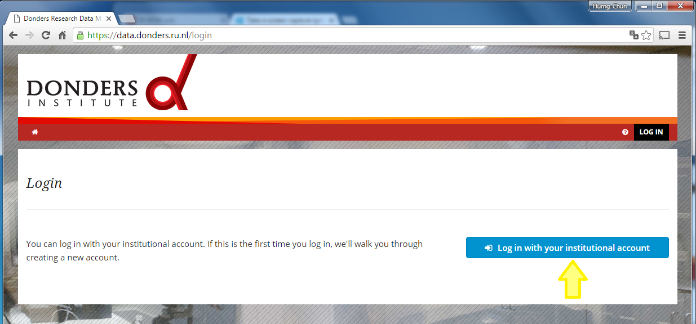
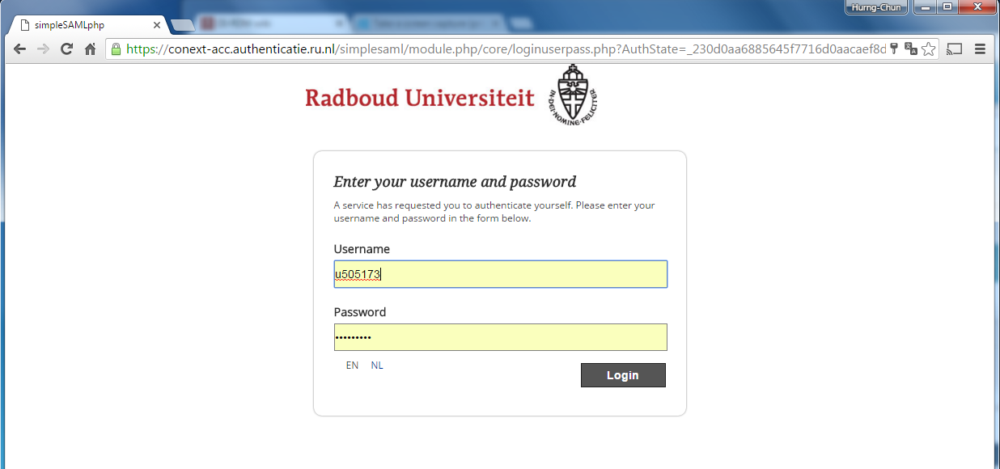

# Login to the RDM CMS portal

## Requirement

Before logging-in to the RDM CMS portal, you are required to have a valid user account issued by one of the identity providers (IdP's) supported by SURFConext.  Generally speaking, identity providers from universities and research institutions within Netherlands are well covered by SURFConext. 

A list of SURFConext-supported IdP's can be looked up [here](https://www.surf.nl/over-surf/werkmaatschappijen/surfnet/over-surfnet/aansluiten-op-surfnet/aangesloten-instellingen/index.html). 

## Instruction

As long as you have a valid account issued by a SURFConext trusted identity provider (i.e. SURFConext IdP account), you can follow the instructions below to sign-up/in to the RDM CMS portal.

1. Open the URL (https://data.donders.ru.nl) in your web browser.  You will see the homepage of the CMS portal.

  

2. At the top-right corner, you will find a `LOG IN` button.  Click it to login with your SURFConext IdP account.

  

3. You will be redirected to the SURFConext page on which a list of identity providers are listed.  Use the search field to find your home organisation and click on it for authentication. 

  

4. You will be again redirected to the `login` page of your home organisation.  Fill in the credential (e.g. username and password) of the user account issued by your home organisation.

  

5. Following a successful authentication checked by your home organisation, you are logged in to the CMS portal as a registered RDM user. You will be re-directed back to the RDM CMS portal, and to a so-called `Collections` page. The list of RDM collections displayed on this page depends on your authorisation in the RDM system. After your first successful login, you will most likely see not a single collection. This is because, in order to get access to a particular collection, you must be added to it (as a _viewer_ or a _contributor_) by the collection's _manager_. 

  
