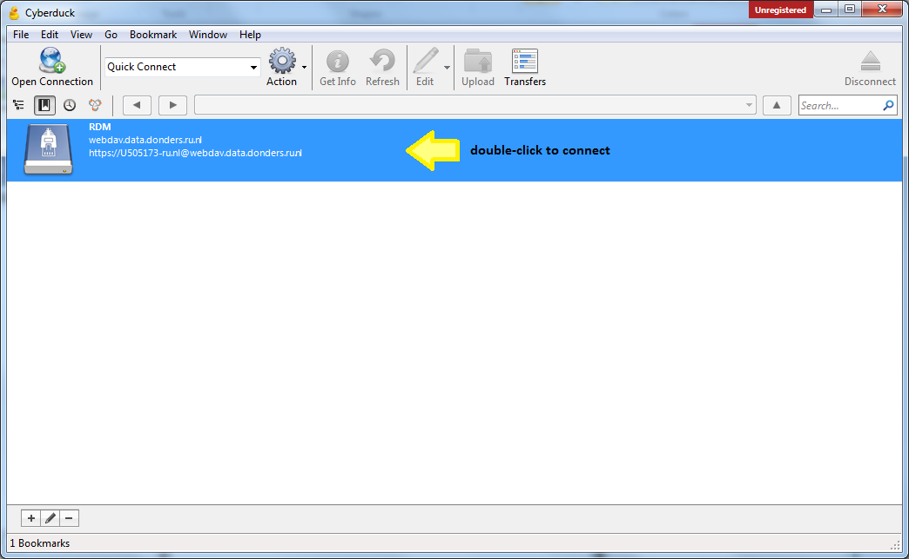
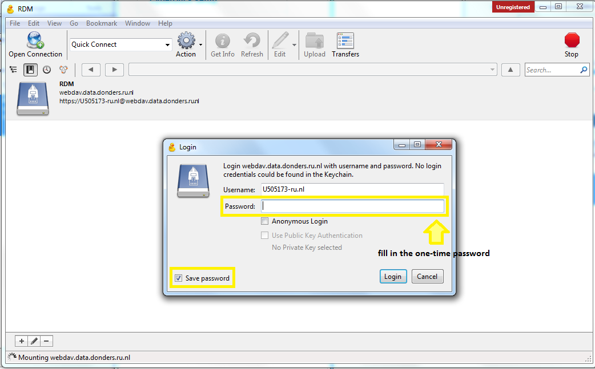
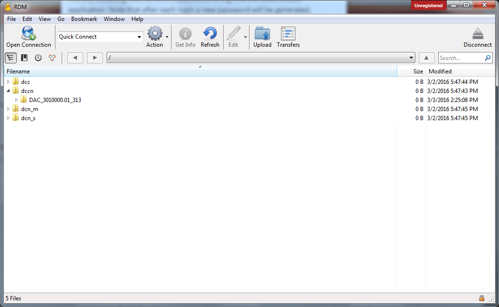
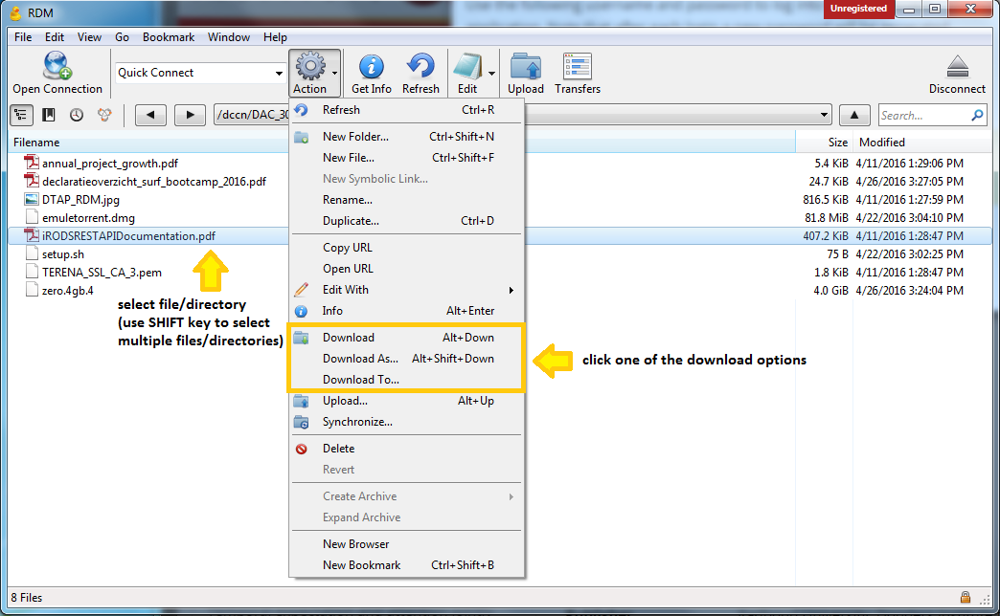
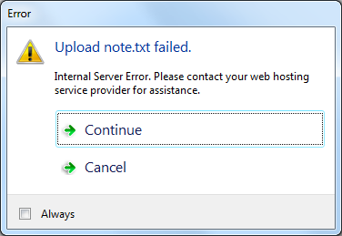
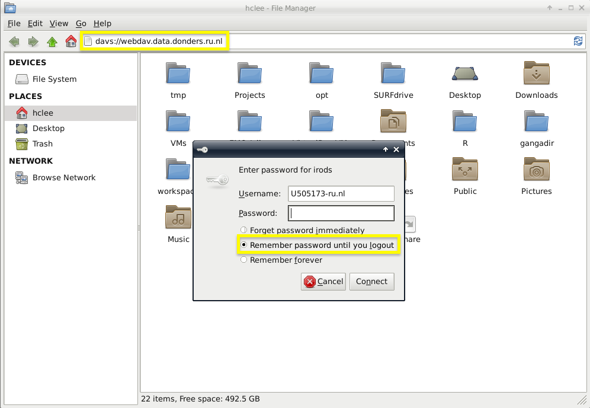

# Accessing collection data using WebDAV client

The data content of a RDM collection consists of files and directories. To access the data content, one uses a HTTP-based file transfer protocol called [WebDAV](https://en.wikipedia.org/wiki/WebDAV).
You will be asked to provide the username and password to login.  Follow [this instruction](account.md#The_Webdav_Account) to retrieve them from the CMS portal.

There are existing client tools for the WebDAV protocol. However, concerning the best compatibility and cross-platform support, please use the recommended tools:

 - [for Windows users](#Windows)
 - [for MacOSX users](#MacOSX)
 - [for Linux users](#Linux)

Attention: Although the native file browser of Windows (i.e. Explorer) and MacOSX (i.e. Finder) works with the WebDAV protocol, they are __NOT__ compatible with the RDM WebDAV service. Please don't use them to access data in the RDM system.

## Windows

For Windows user, the recommended WebDAV client is [CyberDuck](#CyberDuck). 

## MacOSX

For MacOSX user, the recommended WebDAV client with GUI support is [CyberDuck](#CyberDuck), or [Duck](#Duck) if a command-line tool is your preference.

## Linux

For Linux user, the [Thunar file manager](#Thunar) of XFCE is a recommended graphical WebDAV client.  Alternatively, [Duck](#Duck) and [Cadaver](#Cadaver) are good command-line tools for shell scripting.

## Instructions

### CyberDuck

#### Installation

Warning: Due to a [bug](https://trac.cyberduck.io/ticket/9358) in Cyberduck, you will encounter an error when verifying the SSL certificate if a version between 4.8.0 and 4.8.3 is used.  Please use either version 4.7.3 or a version >= 4.8.4.

For Windows and MacOSX systems, the CyberDuck installation is graphical and self-explanatory. Simply download the installer from [the software's website](https://cyberduck.io) and follow instructions step-by-step while executing the installer. You will need the administrator's right to install CyberDuck software on your computer.

For Linux users, CyberDuck is provided as a command-line tool called [duck.sh](https://duck.sh). The installation instruction can be found [here](https://trac.cyberduck.io/wiki/help/en/howto/cli#Linux).

Hint: For Linux users, you might want to consider alternative clients like [Duck](#Duck) or [Cadaver](#Cadaver) for a better user interface.

#### Setup

Note: This instruction covers only the graphical user interface of CyberDuck. For [duck.sh](https://duck.sh) user, please refer to [this general usage how-to](https://trac.cyberduck.io/wiki/help/en/howto/cli#Usage).

1. Open the CyberDuck application, and create a new connection bookmark:

  

2. Configure the connection with the following parameters:

  * __WebDAV (HTTP/SSL)__
  * Server: __webdav.data.donders.ru.nl__
  * Port: __443__
  * Username: __untick the `Anonymous Login` and set it to the _username_ of the [data-access account](data_access_account.md)__
  
  The configurations are saved to the bookmark on-the-fly.  Just close the configuration window when you are done with the configuration.

  

3. Click on the saved bookmark to make connection.  You will be asked for a login password.  Please fill in the _one-time password_ of your [data-access account](account.md#The_Webdav_Account) retrieved from the CMS portal. In the `Login` window, make sure you tick the option `Save password`.

  
  
  

4. Once you login to the WebDAV service, you will see a filesystem-like structure with four directories, each pertains to a centre (or organisational-unit in case of DCN) of the Donders Institute. You may click into a directory and consequently see sub-directories referring to the RDM collections belong to a centre/organisational-unit. Within the directory of a RDM collection, you will see the data content in terms of files and directories.

  

 In the subtree of a particular center, you will see the directories of all RDM collections of that center. By clicking on a directory, you can also enter it, but you can only see its files and subdirectories if you are authorised (i.e., if you are a viewer, contributor or manager of the corresponding collection). As a viewer of the collection, you are only allowed to download data content (files/directories) from a collection.  As a contributor or manager, you are also allowed to upload and modify data via the WebDAV client. 

5. __Downloading files/directories:__ After entering an RDM collection's directory, as long as you see a file or directory, you may trigger the downloading process by selecting files (or directories) followed by clicking the `Action` botton on the menu bar.  In the pull-down menu of the `Action` botton, chose one of the downloading options and follow the dialog to save the file/directory locally.  See the screenshot below:

  

6. __Uploading files/directories:__ After entering an RDM collection's directory, you can upload the file by selecting the `Action` botton on the menu bar.  A dialog will pop-up for you to select local files/directories to be involved in the uploading process.  See the screenshot below:

  

 If you try to upload files to a directory for which you are not authorised (i.e., you are not a contributor or manager of the corresponding collection), you will get an `Internal Server Error` message similar to the screenshot below.
 
 

Note: If the client (i.e. the Cyberduck) is idle for two hours (e.g. no browsing or data transfer activities), you will be logged out automatically by the WebDAV server. In this case, you will have to login again with a fresh one-time password. 

### Thunar

In a Linux terminal, open the Thunar file manager with command

```bash
$ thunar
```

In the browser bar at the top, type the following address

```bash
davs://webdav.data.donders.ru.nl
```

You will be asked to provide the username and password to login.  Follow [this instruction](account.md#The_Webdav_Account) to retrieve them from the CMS portal.  Before you click the `Connect` button, make sure the item __Remember password until you logout__ is ticked.  A screenshot of this window is shown below:



### Cadaver

In a Linux terminal, type the following command

```bash
$ cadaver https://webdav.data.donders.ru.nl
```

You will be asked to provide the username and password to login.  Follow [this instruction](account.md#The_Webdav_Account) to retrieve them from the CMS portal.

### Duck

In a Linux terminal, type the following command

```bash
$ duck davs://webdav.data.donders.ru.nl -u U505173-ru.nl
```

You will be asked to provide the and password to login.  Follow [this instruction](./account.md) to retrieve it from the CMS portal.

