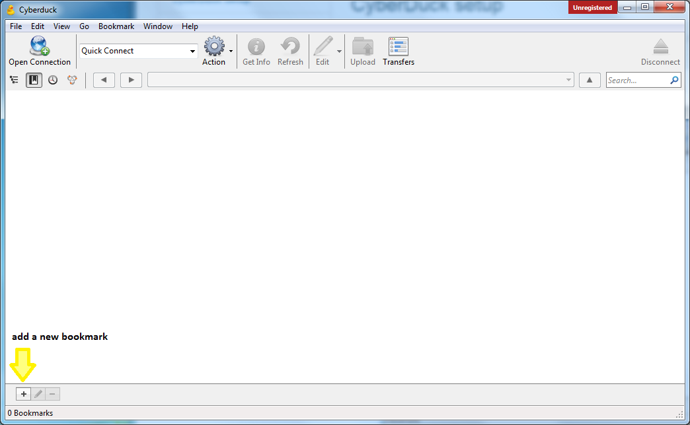
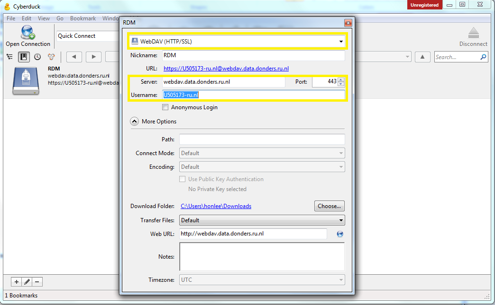

# Accessing collection data using WebDAV client

The data content of a RDM collection consists of files and directories. To access the data content, one uses a HTTP-based file transfer protocol called [WebDAV](https://en.wikipedia.org/wiki/WebDAV).

There are existing client tools for the WebDAV protocol.  However, concerning the best compatibility and cross-platform support, we recommend researchers to use the [CyberDuck](https://cyberduck.io).

## CyberDuck installation

For Windows and MacOSX systems, the CyberDuck installation is graphical and very straight forward.  Simply download the installer from [the software's website](https://cyberduck.io).

For Linux users, CyberDuck is provided as a command-line tools called [duck.sh](https://duck.sh).  The installation instruction can be found [here](https://trac.cyberduck.io/wiki/help/en/howto/cli#Linux).

## Connecting the RDM WebDAV service

Note: This instruction convers only the graphical user interface of CyberDuck. For duck.sh user, please refer to [this general usage](https://trac.cyberduck.io/wiki/help/en/howto/cli#Usage).

1. Open the CyberDuck application, and create a new connection as a bookmark:
  

2. Configure the connection using the following parameters:
  

  * Connection protocol: choose __WebDAV (HTTP/SSL)__
  * Server: __rdmappacc.uci.ru.nl__
  * Port: __8443__
  * Username: _the data access username retrieved from the [CMS portal](user_signup.md)_
  * Path: __rdm-webdav__

3. Click on the saved bookmark to make connection.  You will be asked for a login password.  The data access password can also be retrieved from the CMS portal. 
  

4. Once you loggin to the WebDAV service, you will see a filesystem-like structure with four directories, each represents a centre of the Donders Institute. You may click into a directory and consequently see sub-directories representing the RDM collections belong to a centre. Within the RDM collection, you will see the data content as files and directories.
  

5. As a viewer of the collection, you are only allowed to download data content (files/directories) from a collection.  As a contributor or manager, you are also allowed to upload and modify data via the WebDAV client. 

## Verified alternative clients

The table below provides a list of tested WebDAV clients that work smoothly with the RDM WebDAV service.  You may use them as alternatives to the CyberDuck.
