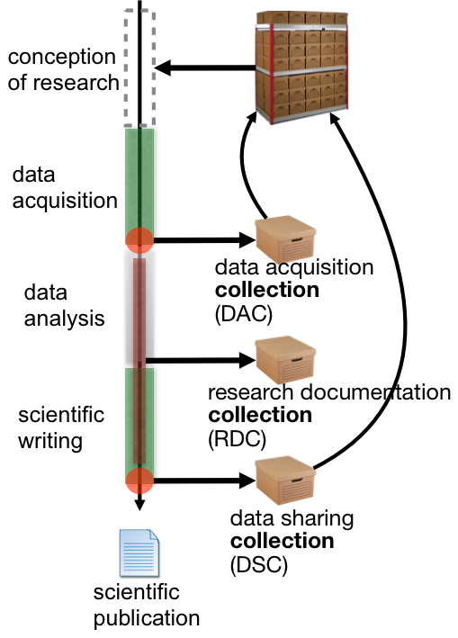

# DI-RDM in a Nutshell

DI = Donders Institute for Brain, Cognition and Behaviour

RDM = Research Data Management

RDM at the DI serves three purposes:

1. _Data preservation_ for internal reuse
2. _Research documentation_ for increasing reproducibility
3. _Data sharing_ with the external scientific community

DI RDM involves a written protocol that describes how one must interact with a _digital data repository_. This data repository involves (1) a storage layer that is managed by an intelligent file system (iRODS), and (2) clients with which one can interact with this file systems. Two clients have a graphical user interface: (1) a web client (https://data.donders.ru.nl, also called _content management system_), and (2) a file transfer client (Cyberduck, which allows to transfer data using the Webdav protocol).

The data repository allows a researcher to archive digital data into collections. The repository contains separate collections for preservation, for research documentation and for sharing:

1. In a _Data Acquisition Collection_ (DAC), the data are archived in their original form. Here, _original_ means _without any manipulations that limit future analyses of these data_.
2. A _Research Documentation Collection_ (RDC) documents the process via which data are converted into published results. 
3. A _Data Sharing Collection_ (DSC) contains the data that on which published results are based, allowing external researchers to extend scientific findings by reanalyzing data with new methods, and/or by addressing new research questions using these data.

These three collections are built at different stages of a research project, as illustrated here:

  
  
Note that an empirical research project can start from existing DACs and/or DSCs, and therefore it is not required that new data have to be acquired for this project.

Repository users can have different predefined roles in a collection. These roles differ in their rights with respect to the collection:

1. A _manager_ can add and remove users to the collection, and can change the role of other users. A manager also has the rights of a contributor.
2. A _contributor_ can add, modify and delete files. A contributor also has the rights of a viewer.
3. A _viewer_ can view the content of files.

Collection are always initiated by a _research administrator_. A research administrator belongs to a center's administrative staff. As a part of the initiation, the research administrator assigns a manager to the collection, and typically this is also the supervisor of the research project to which this collection belongs. A collection manager can add other users to the collection in the role of manager, and these then obtain the same rights.

